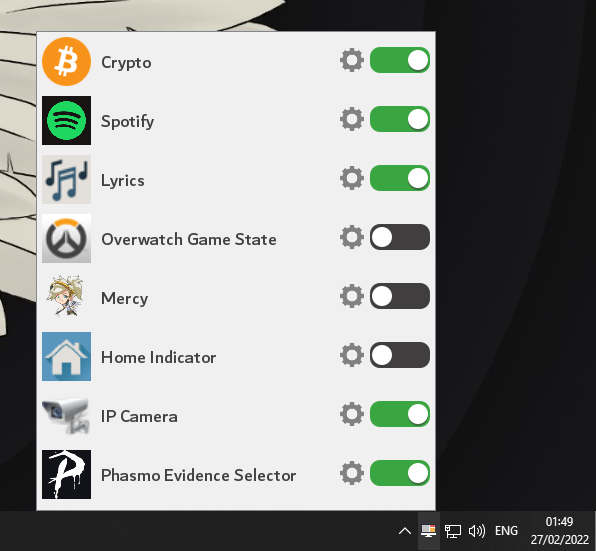

# DesktopModules
DesktopModules is an application that allows you to create overlays for your operating system.
The modules are displayed over all your programs and games and are freely movable.


## Available Addons
- [Spotify](https://github.com/LabyStudio/spotify-addon)

*Feel free to add your addons!*

## Installation
1. Download the artifact from the latest [build](https://github.com/LabyStudio/desktopmodules/actions) and extract the jar file.
2. Place your addon jars in the following directory: ``C:/Users/<name>/AppData/Roaming/DesktopModules/addons/``
3. Run ``desktopmodules-core.jar`` with java

## Settings
You can left-click on the tray icon to manage your installed addons.<br>
You can exit the application by right-clicking the tray icon and selecting "Exit"



## Setup sample module
Set the program start parameters to ```de.labystudio.desktopmodules.sample.SampleAddon```

## Create your own addon
### Setup gradle

```groovy
dependencies {
    implementation 'com.github.LabyStudio:desktopmodules:master-SNAPSHOT'
}

allprojects {
    repositories {
        maven { url 'https://jitpack.io' }
    }
}
```

### Setup your code

The main class of your addon. You have to register your modules in the onEnable method.
```java
import de.labystudio.desktopmodules.core.addon.Addon;
import de.labystudio.desktopmodules.sample.modules.SampleModule;

public class TestAddon extends Addon {

    @Override
    public void onEnable() throws Exception {
        System.out.println("Test addon enabled!");

        // Config example
        if (!this.config.has("flag")) {
            this.config.addProperty("flag", true);

            System.out.println("This addon started for the first time. My config can remember that!");
        }
        
        // Register your modules
        registerModule(TestModule.class);
    }

    @Override
    public void onDisable() {
        System.out.println("Test addon disabled!");
    }
}
```

You can create multiple modules for one addon
```java
import de.labystudio.desktopmodules.core.addon.Addon;
import de.labystudio.desktopmodules.core.loader.TextureLoader;
import de.labystudio.desktopmodules.core.module.Module;
import de.labystudio.desktopmodules.core.module.wrapper.IModuleRenderer;
import de.labystudio.desktopmodules.core.renderer.IRenderContext;

import java.awt.*;
import java.awt.image.BufferedImage;

public class TestModule extends Module<TestAddon> {
    
    private BufferedImage testTexture;

    public TestModule() {
        super(250, 60); // The fixed size of the module
    }
    
    @Override
    public void loadTextures(TextureLoader textureLoader) {
        this.testTexture = textureLoader.loadTexture("textures/test/test.png"); // Load a texture
    }
    
    @Override
    protected String getIconPath() {
        return "textures/test/test.png"; // The settings icon of the module
    }

    @Override
    public String getDisplayName() {
        return "Test Module"; // The setting name of the module
    }

    @Override
    public void onTick() {
        // Do backend stuff..
    }

    @Override
    public void onRender(IRenderContext context, int width, int height) {
        context.drawRect(0, 0, width - 1, height - 1, new Color(50, 50, 50, 130));
        context.drawImage(this.testTexture, 0, 0, height, height);
        
        // Render your module...
    }
}
```

### Test your addon
Launch the main class ``Start`` with the program parameter ``your.package.name.TestAddon``

### Build your addon
To make it available as a jar file, you have to define the addon class name in the ``/addon.json``
```json
{
  "main": "your.package.name.TestAddon"
}
```

To use your addon, put the jar file into the following directory: ``C:/Users/<name>/AppData/Roaming/DesktopModules/addons/``
